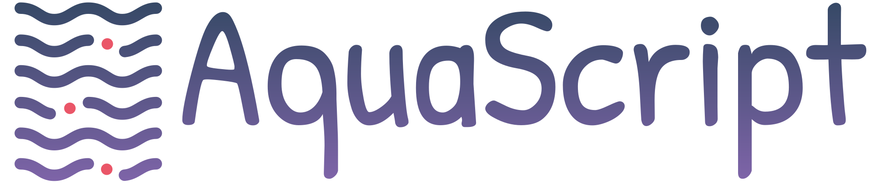

<h1 align="center">



</h1>

<h3 align="center">
🌊 Dimensione seu sistema de recirculação completo em instantes! 🌊
</h3>

## Geral

Aquascript é um software de dimensionamento de sistemas de recirculação para aquicultura, que se beneficia do poder que a arquitetura SPA pode oferecer.

## Key features

- Dimensionamento de SRAs;
- Salva inúmeros sistemas em Local Storage;
- Performance garantida com React/Redux;
- Use da biblioteca unforms by Rocketseat;

## Installation

```
git clone https://github.com/devzunder/ras.git
cd ras
npm install
npm start
```

## License

MIT © [DevZunder](https://github.com/devzunder)
